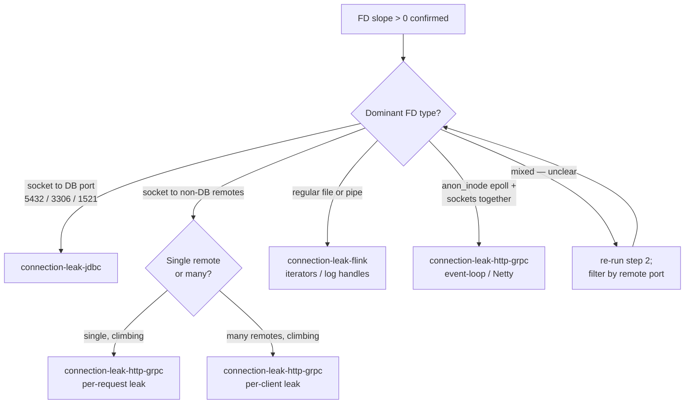

# Connection Leak Hunt

Top-level router. Connection leaks come in three flavors with different signatures and fix patterns:

- **JDBC / DB pool leaks** → `connection-leak-jdbc`
- **Flink connector / `RichFunction` lifecycle leaks** → `connection-leak-flink`
- **HTTP / gRPC client leaks** → `connection-leak-http-grpc`

Symptoms mislead — "Too many open files" can come from any of the three, with wildly different diagnosis paths. Classify before drilling in.

## Cross-cutting triage (always run first)

Run these three steps before opening a sub-skill. They confirm the leak is real, bound the rate, and identify the resource class.

### 1. Confirm the FD trend

For a JVM or Python process in a pod (Flink TaskManager containers run the JVM as PID 1):

```sh
kubectl exec -it <pod> -- sh -c 'ls /proc/1/fd | wc -l; cat /proc/1/limits | grep "open files"'
```

Sample over several minutes. A flat count rules out a leak — the user is likely seeing pool contention, burst load, or a sizing problem, not a leak.

```sh
kubectl exec -it <pod> -- sh -c 'for i in $(seq 1 10); do ls /proc/1/fd | wc -l; sleep 30; done'
```

If the count is monotonically rising, note the slope (FDs/min). That number is the leak rate and you'll use it to verify the fix.

#### Leak rate budget

Convert the slope into urgency. The exact `nofile` limit varies by container runtime (`cat /proc/1/limits` to confirm); the budget below assumes a 64k cap for illustration — divide by your actual cap to recalc.

| Slope (FDs/min) | Time-to-exhaustion @ 64k cap | Action |
|---|---|---|
| < 1 | > weeks | backlog; first verify it's a leak vs slow churn (sample over 24h) |
| 1–10 | days | next-business-day fix; no immediate mitigation needed |
| 10–100 | many hours | same-day fix; mitigate via scheduled restart (`kubectl rollout restart`) if needed |
| 100–1000 | ~hour | page-worthy; restart loop while patching |
| > 1000 | minutes | rollback the offending deploy now; debug after |

If the headroom calc is shorter than your fix-and-deploy cycle, the mitigation (scheduled restart, traffic shedding) is part of the immediate response — don't skip it because "the fix is coming".

### 2. Classify the FDs

```sh
kubectl exec -it <pod> -- sh -c 'ls -l /proc/1/fd | awk "{print \$11}" | cut -d: -f1 | sort | uniq -c | sort -rn'
```

| Dominant FD type | Likely sub-skill |
|---|---|
| `socket` only, paired with `anon_inode` (epoll) climbing | http-grpc (Netty/event-loop) or jdbc |
| `socket` to DB port (5432, 3306, etc.) | jdbc |
| Regular files or `pipe` | flink (RocksDB iterators, log handles) |
| Mixed sockets across many remotes | http-grpc |

For sockets, get the remote endpoints to disambiguate jdbc vs http-grpc:

```sh
kubectl exec -it <pod> -- sh -c 'cat /proc/1/net/tcp | awk "NR>1 {print \$3}" | sort | uniq -c | sort -rn | head -20'
# remote addr is hex: 0100007F:1538 = 127.0.0.1:5432
```

### 3. Identify the runtime

| Runtime | Tools assumed by sub-skills |
|---|---|
| Java / Kotlin | `jcmd`, `jstack`, `jmap`, async-profiler, JFR, Eclipse MAT |
| Python (asyncio or sync) | `py-spy`, `psutil`, `lsof`, `tracemalloc` |

If async-profiler isn't on the image, it can be sideloaded:

```sh
kubectl cp async-profiler-3.0-linux-x64.tar.gz <pod>:/tmp/
kubectl exec -it <pod> -- tar -xzf /tmp/async-profiler-3.0-linux-x64.tar.gz -C /tmp/
```

### 4. Rule out non-leak look-alikes

Before routing, rule out these four. They produce climbing-pool or climbing-FD symptoms that are **not** leaks.

| Symptom | Looks like | Actually | How to rule out |
|---|---|---|---|
| Pool exhausted in first 30s after deploy | Connection leak | Cold pool warming up (`HikariPool starting`) | Wait 60s. If `ActiveConnections` returns to baseline, it was warmup. |
| `ThreadsAwaitingConnection > 0` sustained, but `ActiveConnections == maximumPoolSize` stable | Connection leak draining the pool | Undersized pool for load | Look at `HikariCP.activeConnections` vs `HikariCP.maximumPoolSize` over a quiet window. Active ratio at the ceiling under steady load = sizing problem. |
| FD slope spikes match GC pause spikes | Slow leak | Long GC pause stalling normal close paths | Correlate with `jvm.gc.pause` or `flink_taskmanager_Status_JVM_GarbageCollector_*_Time`. Fix the GC, leak metric should flatten. |
| `ss -tn` shows many `TIME_WAIT` sockets to one remote | Socket leak | Kernel TIME_WAIT accumulation (60s by default) | `TIME_WAIT` does **not** hold an FD on Linux. Check `ls /proc/1/fd | wc -l` — if flat while `ss` count climbs, it's TIME_WAIT and not your problem. |

If any of these explains the data, stop. Don't open a sub-skill.

## Routing

| Resource type | Symptom signature | Sub-skill |
|---|---|---|
| DB connections | HikariCP `getConnection` timeouts, idle-in-transaction climbing on the DB side, sink throughput collapse | `connection-leak-jdbc` |
| Flink operator state | FD count climbs in lockstep with checkpoint count or restart count, slow `cancel`, "Task did not exit gracefully" | `connection-leak-flink` |
| HTTP / gRPC sockets | `lsof` shows growing ESTABLISHED or CLOSE_WAIT to non-DB ports, Netty `LEAK:` lines in logs | `connection-leak-http-grpc` |

If the user is unsure which, run cross-cutting triage steps 1 and 2 to disambiguate before routing.

### Routing flowchart



## Prevent

Catch leaks before they page. Standing Prometheus alerts that have caught leaks before they exhaust:

```yaml
# fd-leak-pod-level — catches any service whose FDs climb monotonically
- alert: PodFDClimbing
  expr: |
    deriv(container_file_descriptors{pod!=""}[15m]) > 0.5
    and avg_over_time(container_file_descriptors{pod!=""}[30m])
        > avg_over_time(container_file_descriptors{pod!=""}[6h] offset 6h) * 1.2
  for: 30m
  annotations:
    summary: "{{ $labels.pod }} FD count climbing >0.5/s for 30m"
    runbook: "open connection-leak-hunt; classify FDs via /proc/1/fd"

# fd-near-limit — last-chance backstop (calibrate threshold per your nofile cap)
- alert: PodFDNearLimit
  expr: container_file_descriptors > 50000   # ~75% of a 64k cap; adjust to your ulimit
  for: 5m
```

`deriv` not `rate`, because FD count is a gauge that can also fall. The `offset 6h` baseline catches slow leaks that don't trip a fixed threshold.

## Related

- [`connection-leak-jdbc`](../connection-leak-jdbc/SKILL.md) — use when classification step 2 shows DB sockets dominating.
- [`connection-leak-flink`](../connection-leak-flink/SKILL.md) — use when the pod is a TaskManager and the slope tracks job-restart count.
- [`connection-leak-http-grpc`](../connection-leak-http-grpc/SKILL.md) — use for ESTABLISHED/CLOSE_WAIT growth to non-DB ports or Netty `LEAK:` lines.

## Style

This skill family uses imperative, command-block style. Show the audit command, show the fix, move on. Skip primer-style explanations. Comments inside code blocks should be load-bearing — no decorative narration.
